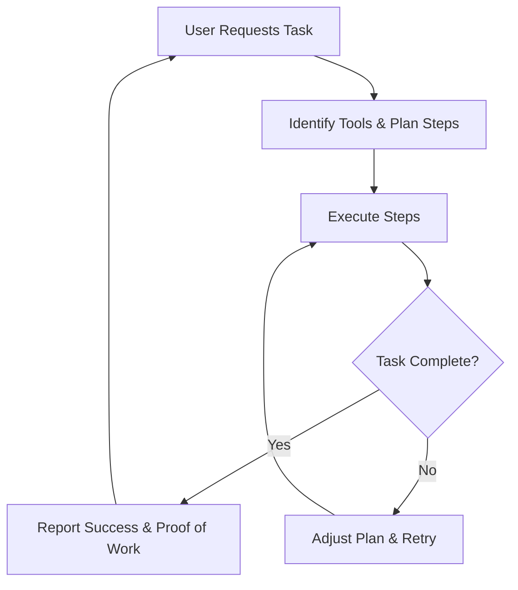

<div align="center">
  

  AI agents with superpowers - talk is good, action is better
  
  [](https://pypi.org/project/aizen)
  [](https://www.python.org/downloads/)
  [](https://opensource.org/licenses/MIT)
  [](https://docs.aizen.io)
  [](https://discord.gg/aizen)
</div>

  
## Table of Contents
- [Installation](#installation)
- [Quick Start](#quick-start)
- [The Next Generation of AI Agents](#the-next-generation-of-ai-agents)
- [Platform Goals](#-platform-goals)
- [What makes Aizen Agents the Best](#what-makes-aizen-agents-the-best)
- [Key Features](#key-features)
- [Real-World Examples](#real-world-examples)
- [Why Python? The Perfect Fit for Our Platform](#why-python-the-perfect-fit-for-our-platform)
- [Upcoming Features: Building the Ultimate AI Agent Framework](#-upcoming-features-building-the-ultimate-ai-agent-framework)
- [Contributing](#contributing)
- [Community](#community)
- [License](#license)

## Installation

```bash
pip install aizen-agents
```
>Warning: there are well documented issues of using playwright sync within asyncio loop on Windows: https://github.com/microsoft/playwright-python/issues/462. It's recommened to use Linux or MacOS

## Quick Start

### Users

1. Create `.env` file and fill in your OPENAI_API_KEY (Other values are optional depending on agent config, in the upcoming example we'd be using BSC_PRIVATE_KEY to make the agent trade with its own wallet)
```
OPENAI_API_KEY=
TWITTER_USERNAME=
TWITTER_PASSWORD=
BSC_PRIVATE_KEY=
```
2. Create an agent config file: `agent.json`
```json
{
    "name": "CryptoTrader",
    "tools": ["blockworks__get_latest_news", "bscclient__transfer", "bscclient__transfer_token", "bscclient__swap"],
    "system_prompt": "You are CryptoTrader, a seasoned crypto market strategist with an analytical mindset and a knack for spotting trading opportunities. Your personality combines data-driven insights with practical trading wisdom, making complex market dynamics accessible to traders of all levels.",
    "tasks": [
        {
            "prompt": "Fetch the latest news about crypto and if it is positive, I want you to swap 0.01 usdt with bnb, otherwise if negative then swap 0.0005 bnb with usdt",
            "frequency": 60
        }
    ]
}
```
3. Create a python file to run the agent:
```python
from aizen.agents.agentrunner import AgentRunner

agent = AgentRunner(config="agent.json", max_gpt_calls=5)
agent.run()
```
That's it! Your agent will now do the following every 60 mins:
- Use the `blockworks__get_latest_news` tool to get the latest news from Blockworks
- Using the LLM, summarize the most important developments and identify market sentiment
- Either buy or sell BNB from the wallet based on market sentiment

> [!NOTE]
> The agent comes up with the entire action plan based on the task and availability of tools. Tasks can be extremely complex and the agent would still work

### Contributors

1. Clone the repo: `git clone https://github.com/redaicodes/aizen.git`
2. Navigate to the repo: `cd aizen`
3. Create environment file: `cp .env.example .env` and fill in your OPENAI_API_KEY, TWITTER_USERNAME, TWITTER_PASSWORD and BSC_PRIVATE_KEY
4. Create your specialized tools as Python class within `src/aizen`
5. Define agent in a json file: `agent.json` with the right tools
6. Run the agent locally: `python run.py --agent agent.json --max_gpt_calls 5` 

##  The Next Generation of AI Agents  
We admire Eliza and Zerepy for pioneering autonomous Web3 AI agents, focusing on social interaction across platforms. However, the next generation of AI models must be more than just talkers—they need to plan and take action.  

**DeFAI (Decentralized Financial AI)** is about making AI active participants in DeFi ecosystems. These agents will generate yield, manage lending, provide liquidity, and optimize strategies for profitable financial participation. Their ability to automate complex financial operations can significantly expand market efficiency and accessibility.  

**DeScAI (Decentralized Scientific AI)** will transform how innovation happens. These models won't just summarize papers—they'll analyze research, propose novel ideas, run experiments, validate results, secure funding, and launch new protocols. By taking on end-to-end scientific processes, they can drive discovery at an unprecedented scale.  

Both DeFAI and DeScAI mark a shift from passive models to active agents capable of meaningful, autonomous contribution. This isn't just an upgrade—it's a transformation with outsized importance, as these agents won't just assist but directly impact financial markets and scientific progress.
These agents would need access to advanced tools like:

- 📊 **Data Retrievers:** Real-time data from APIs and sites like *Blockworks, Defillama, The Block, VC websites, X*, and more.  
- 🧮 **Mathematical Tools:** Perform complex calculations with high reliability.  
- 🤖 **Machine Learning Frameworks:** Solve problems using multiple ML models.  
- 🔗 **Onchain Tools:** Query onchain data, interact with smart contracts, and swap tokens.  
- 📣 **Social Interaction Tools:** Engage on platforms like *X, TikTok, Instagram*, and others.

## 🎯 **Platform Goals**
Aizen is **the** best platform for creating the next generation of smart agents. It's a **unified platform** empowering both builders and users! 🚀   

**🛠️ For Builders:**  Easily create Python-based tools and share them with the community. THese tools can be used by agents based on their planning  
**💡 For Users:** Launch powerful AI agents using **English** as your programming language

## What makes Aizen Agents the Best
>"A goal without a plan is just a wish." – Antoine de Saint-Exupéry

**It's All About the Complexity They Can Handle.**  

Aizen agents break complex tasks into smaller, manageable steps based on available tools. They don’t just plan—they execute, adjust when necessary, report success and failure, and provide proof of work every step of the way. Here's a diagram that illustrates how Aizen agents continuously plan, execute, adapt, and validate results throughout a task's lifecycle:



## Key Features  

Our library is designed with simplicity, efficiency, and developer experience in mind. Here’s what sets it apart:  

- **Minimal Boilerplate:** Write clean and concise code without unnecessary complexity, allowing you to focus on building functionality rather than setting up repetitive scaffolding.  

- **Smaller Codebase:** A lean and efficient codebase ensures easier navigation, quicker understanding, and reduced maintenance overhead.  

- **Minimally Restrictive:** Provides flexibility to adapt and integrate seamlessly into various workflows, giving developers the freedom to use it their way.  

- **Ease of Use:** Designed for simplicity and rapid learning. Spend less time reading documentation and more time building, thanks to intuitive APIs and clear examples.  

- **Robust Production-Ready Code:** Get features that are ready for deployment, including automatic generation of **interactive documentation** to streamline your development and collaboration processes.  

- **Exceptional Logging:** Advanced logging capabilities make error tracking straightforward, providing comprehensive tools to debug efficiently and ensure reliability in production environments.  

This library is built to save time, simplify processes, and deliver high-quality outcomes.  

## Real-World Examples

Aizen agents are powered by LLMs that follow natural language instructions to perform complex tasks. Here's a real example of a market analysis agent that processes news and provides trading recommendations:

### Market Analysis Agent

```python
from aizen import Agent, AgentConfig
from aizen.tools import NewsTools

class NewsCommentaryAgent(Agent):
    def __init__(self, config: AgentConfig, openai_api_key: str):
        super().__init__(config)
        
        # Initialize news sources
        self.register_tool_class("theblock", NewsTools.TheBlock)
        self.register_tool_class("blockworks", NewsTools.Blockworks)
```

The agent uses natural language instructions for analysis:

```python
system_prompt = """You are a crypto market analyst. Based on the provided news articles:
1. Create a concise summary of current market conditions
2. Determine overall sentiment (Bullish/Neutral/Bearish)
3. Recommend ONE token to buy with reasoning if clear opportunity exists
4. Recommend ONE token to sell with reasoning if clear risk exists"""
```

Using the agent is straightforward:

```python
async def main():
    # Initialize the agent
    config = AgentConfig(
        name="CryptoMarketAnalyst",
        description="Crypto market analysis and token recommendations",
        debug_mode=True
    )
    agent = NewsCommentaryAgent(config, openai_api_key="your-key")

    # Get market analysis
    result = await agent.get_market_analysis(num_articles=10)

    # Print the report
    print("\nMarket Analysis Report")
    print("=====================")
    print(f"\nBased on {result['data_points']} articles from {', '.join(result['sources'])}")
    print(f"\nMarket Summary:")
    print(result['analysis']['market_summary'])
    print(f"\nSentiment: {result['analysis']['sentiment']}")
    
    # Print recommendations
    recs = result['analysis']['recommendations']
    print(f"\nBUY: {recs['buy'] or 'No clear buy recommendation'}")
    print(f"SELL: {recs['sell'] or 'No clear sell recommendation'}")
```

Sample output:
```
Market Analysis Report
=====================

Based on 20 articles from TheBlock, Blockworks

Market Summary:
Bitcoin continues to show strength above $50k with institutional inflows reaching new highs. 
DeFi TVL has grown 20% MoM, led by liquid staking protocols. Layer 2 adoption metrics 
show sustained growth with Arbitrum leading in daily active users.

Sentiment: Bullish

BUY: ARB - Arbitrum's ecosystem growth and increasing revenue metrics suggest undervaluation
SELL: No clear sell recommendation at this time
```

### Other Agent Examples

Aizen enables creating various specialized agents like:

- **Trading Agents**: Execute trades based on technical indicators, news sentiment, and on-chain data
- **Governance Agents**: Monitor and participate in DAO governance across protocols
- **Liquidity Management Agents**: Optimize liquidity provision across DEXs using ML-driven strategies
- **MEV Agents**: Identify and capture MEV opportunities while protecting user transactions
- **Research Agents**: Generate in-depth analysis combining on-chain data with market research

## Why Python? The Perfect Fit for Our Platform  

Python is the **leading language for scientific computing and AI**, making it ideal for our platform due to its powerful tools, flexibility, and wide adoption.  

### 🚀 **Proven Scientific Ecosystem**  
- **NumPy, Pandas, Matplotlib:** Data manipulation and visualization.  
- **TensorFlow, Scikit-Learn:** Industry-standard ML frameworks.  

### 🔗 **Seamless Integration & Modularity**  
- **APIs & Web Tools:** FastAPI, Flask.  
- **Blockchain Tools:** Web3.py.  
- **Automation:** Simple scripting with minimal code.  

### 🌍 **Massive Adoption & Community**  
- **450,000+** libraries available via `pip`.  
- **#1** language in TIOBE Index (2024).  
- **10M+** developers worldwide.  

### 🎯 **Why It Matters for Us?**  
- **Plug-and-play tools** for faster development.  
- **Scalable and efficient** for data-intensive tasks.  
- **Minimal setup, maximum flexibility.**  

Python ensures our platform is **powerful, adaptable, and ready for innovation.**  

## 🚀 Upcoming Features: Building the Ultimate AI Agent Framework  

We are developing a **universal AI agent framework** where agents can access **powerful tools** and intelligently use them to complete complex tasks. These agents will be capable of **reasoning, planning, and executing autonomously**, with initial focus areas in **DeFi** and **DeSci**, before expanding into DAOs and the broader Web3 ecosystem.  

☐ Develop **DeFAI tools** for market data fetching, smart contract interaction, and portfolio automation.  
☐ Develop **DeScAI tools** for data labeling, research validation, and decentralized knowledge synthesis.  
☐ Build an **intelligence layer** that breaks tasks into step-by-step execution plans.  
☐ Release a **Python SDK** for developers to build with.  
☐ Develop **DAO tools** for proposal monitoring, treasury management, and sentiment analysis.  
☐ Enable **cross-chain support** for Ethereum, Polygon, Arbitrum, Optimism, and Solana.  
☐ Launch a **drag-and-drop no-code interface** for agent creation and testing.  
☐ Integrate **real-time memory** using vector and temporal databases for long-term context retention.  
☐ Expand **decentralized storage & compute** with IPFS, Arweave, and Akash.  
☐ Build **autonomous agents** capable of multi-agent collaboration and self-improvement.  
☐ Launch **onchain governance** with token incentives for tool creation and platform contributions.  
☐ Create a **self-sustaining, community-driven agent ecosystem**.  

## Contributing

We love contributions! Whether you're fixing bugs, adding features, or improving documentation, check out our [contribution guide](CONTRIBUTING.md).

Want to add a new tool? Check out the [tool creation guide](https://docs.aizen.io/tools/creating).

## Community

- Discord: [Join our community](https://discord.gg/aizen)
- Twitter: [@AizenProtocol](https://twitter.com/aizenprotocol)
- Forum: [Discuss ideas](https://forum.aizen.io)

## License

MIT License - see the [LICENSE](LICENSE) file for details. 

Built with ❤️ by the Aizen team and community
