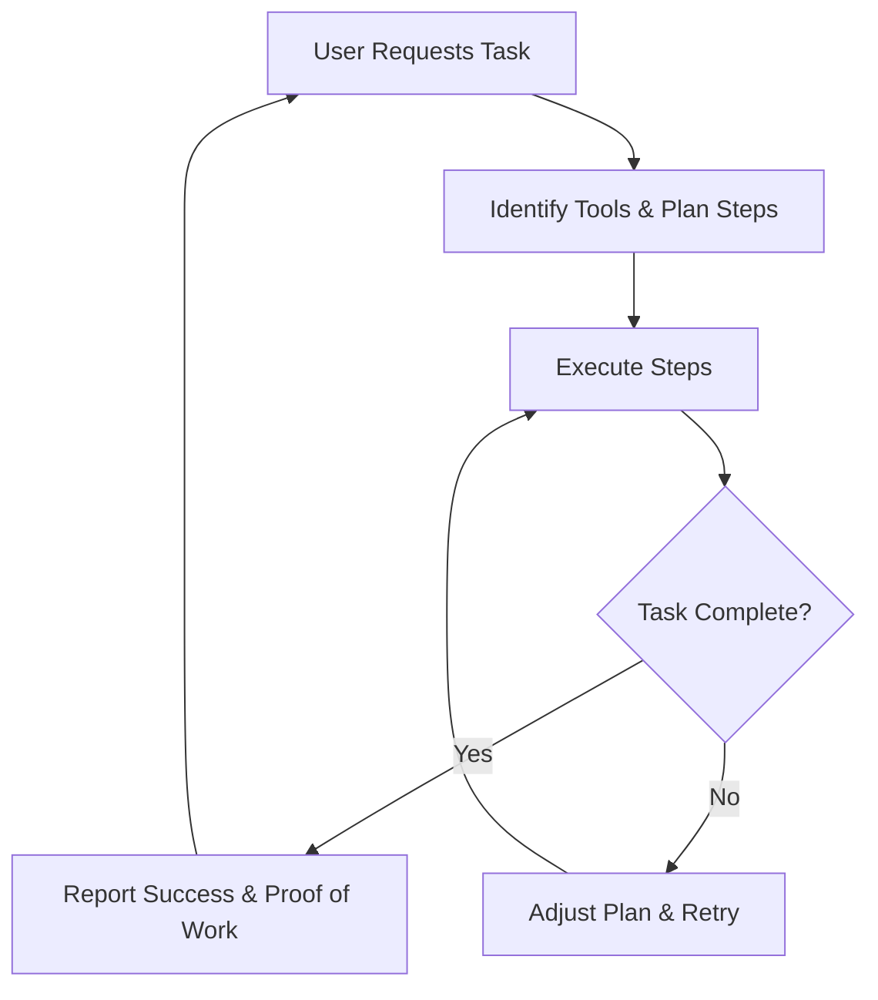

# Platform Features

## What Makes Aizen Agents the Best

> "A goal without a plan is just a wish." – Antoine de Saint-Exupéry

It's all about the complexity they can handle. Aizen agents break complex tasks into smaller, manageable steps based on available tools. They don't just plan—they execute, adjust when necessary, report success and failure, and provide proof of work every step of the way.

## Agent Workflow

## Upcoming Features

☐ **DeFAI Tools**

-   Market data fetching
-   Smart contract interaction
-   Portfolio automation

☐ **DeScAI Tools**

-   Data labeling
-   Research validation
-   Knowledge synthesis

☐ **Platform Features**

-   Intelligence layer for task planning
-   Python SDK for developers
-   DAO tools for governance
-   Cross-chain support
-   No-code interface
-   Real-time memory
-   Decentralized storage & compute

☐ **Advanced Capabilities**

-   Multi-agent collaboration
-   Self-improvement mechanisms
-   Onchain governance
-   Token incentives
-   Community-driven ecosystem
