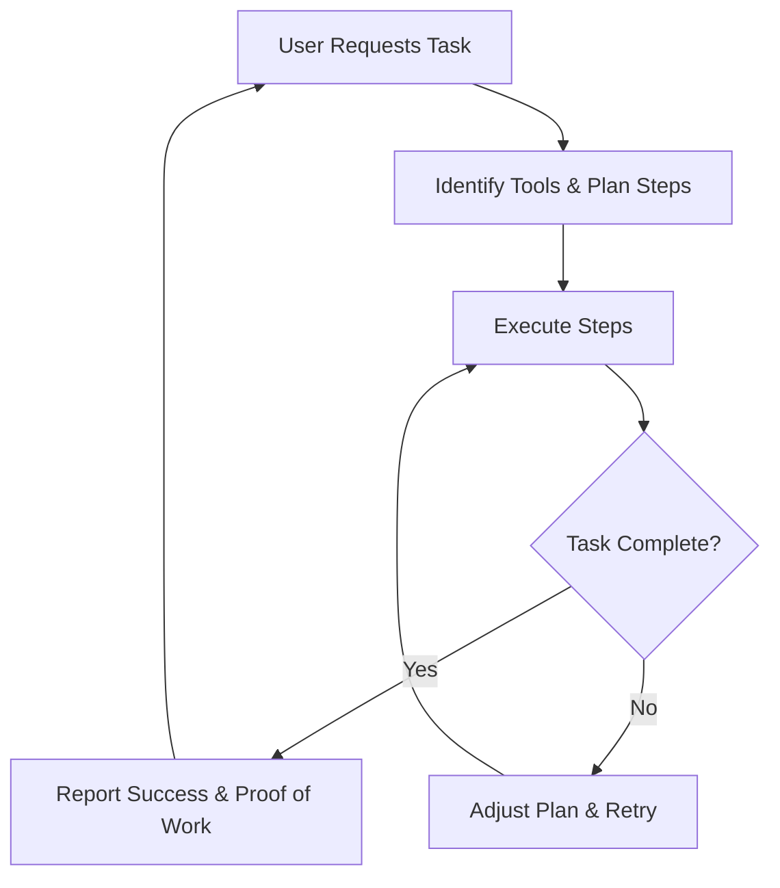

# Aizen: AI agents with superpowers

-   :rocket: **Next Generation**
    
    The next generation of AI agents that plan and take action

-   :tools: **Tool Integration**

    Extensive protocol integration with DeFi, social platforms, and data sources

-   :bar_chart: **Real-Time Data**

    Live market data, sentiment analysis, and on-chain analytics

-   :heart: **Open Source**

        Built by the community, for the community

    

## The Next Generation of AI Agents

We admire Eliza and Zerepy for pioneering autonomous Web3 AI agents, focusing on social interaction across platforms. However, the next generation of AI models must be more than just talkers—they need to plan and take action.

### DeFAI (Decentralized Financial AI)

DeFAI is about making AI active participants in DeFi ecosystems. These agents will:

-   Generate yield
-   Manage lending
-   Provide liquidity
-   Optimize strategies for profitable financial participation

Their ability to automate complex financial operations can significantly expand market efficiency and accessibility.

### DeScAI (Decentralized Scientific AI)

DeScAI will transform how innovation happens. These models will:

-   Analyze research
-   Propose novel ideas
-   Run experiments
-   Validate results
-   Secure funding
-   Launch new protocols

## Advanced Tools

-   📊 **Data Retrievers:** Real-time data from APIs and sites like _Blockworks, Defillama, The Block, VC websites, X_, and more.
-   🧮 **Mathematical Tools:** Perform complex calculations with high reliability.
-   🤖 **Machine Learning Frameworks:** Solve problems using multiple ML models.
-   🔗 **Onchain Tools:** Query onchain data, interact with smart contracts, and swap tokens.
-   📣 **Social Interaction Tools:** Engage on platforms like _X, TikTok, Instagram_, and others.

## How Agents Work

